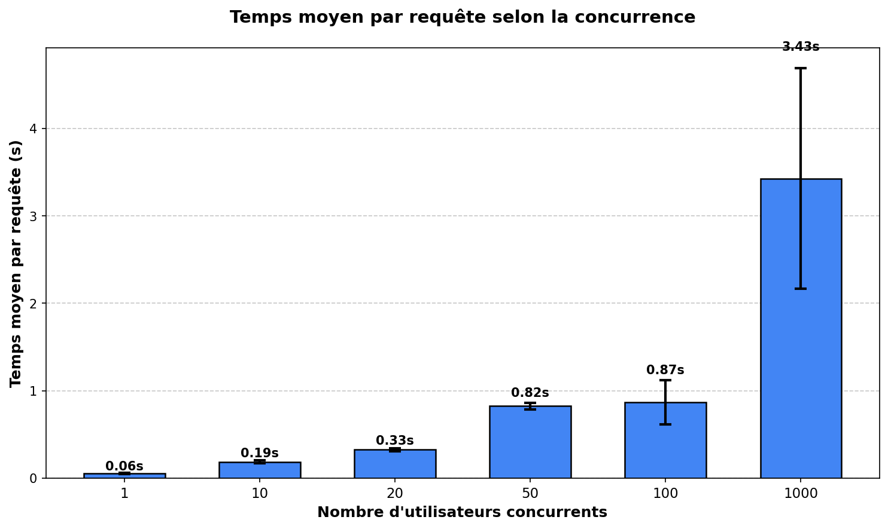
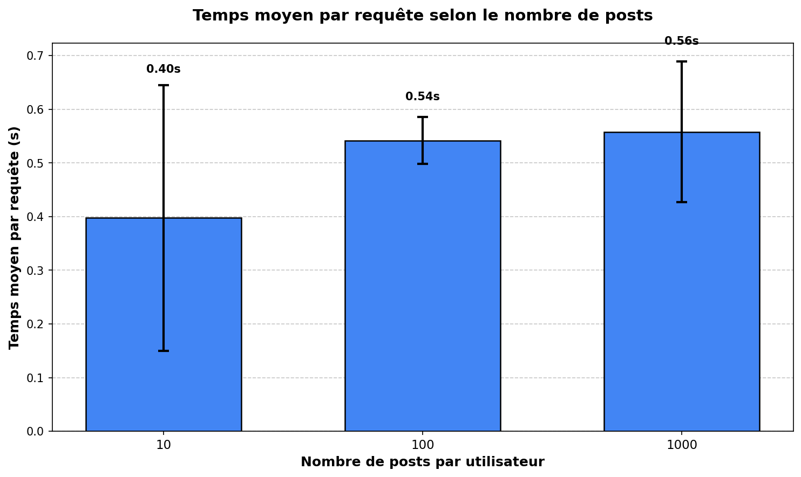
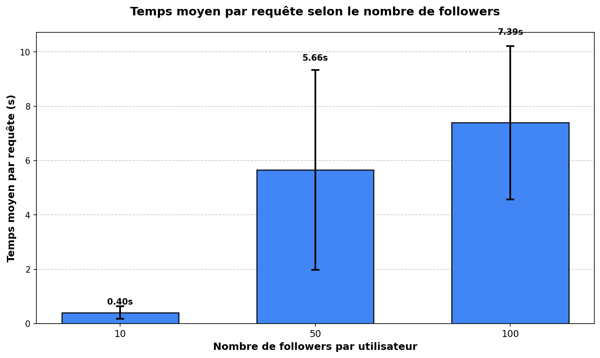

# TinyInsta Benchmark

Projet de benchmark pour l'application TinyInsta déployée sur Google App Engine.

## Application déployée

🔗 **https://tinyinsta-480307.lm.r.appspot.com**

## Résultats des benchmarks

### Test 1 : Passage à l'échelle sur la concurrence

Configuration : 1000 utilisateurs, 50 posts/utilisateur, 20 followers/utilisateur



### Test 2 : Passage à l'échelle sur le nombre de posts

Configuration : 1000 utilisateurs, 50 requêtes simultanées, 20 followers/utilisateur



### Test 3 : Passage à l'échelle sur le fanout (followers)

Configuration : 1000 utilisateurs, 50 requêtes simultanées, 100 posts/utilisateur



## Exécution des benchmarks

### Lancer tous les tests

```bash
snakemake -j1
```

### Lancer un test spécifique

```bash
# Test concurrence uniquement 
snakemake out/conc.png -j1

# Test posts uniquement 
snakemake out/post.png -j1

# Test fanout uniquement 
snakemake out/fanout.png -j1
```

## Méthodologie

### Approche

Ce projet utilise **Locust** pour les tests de charge, conformément aux recommandations du professeur. 

### Workflow

Pour chaque configuration de test :
1. **Vidage** du Datastore (User + Post)
2. **Seed** des données via script Python local 
3. **Attente** de 30s pour la propagation (eventual consistency)
4. **Benchmark** avec Locust (3 runs de 60s par configuration)
5. **Génération** du graphique

### Configurations testées

| Test | Users | Posts/user | Followers | Concurrent | Variable |
|------|-------|------------|-----------|------------|----------|
| Conc | 1000 | 50 | 20 | 1→1000 | Concurrence |
| Post | 1000 | 10→1000 | 20 | 50 | Nb posts |
| Fanout | 1000 | 100 | 10→100 | 50 | Nb followers |


### Pourquoi vider la base entre chaque config ?

- Évite l'accumulation de données qui fausse les résultats
- Garantit des conditions de test reproductibles
- Réduit les coûts de stockage Datastore

### Eventual consistency

Le Datastore utilise un modèle de consistance éventuelle pour les requêtes globales.
Un délai de 30s est ajouté après chaque seed pour laisser les données se propager.

## Structure du projet

```
tinyinsta/
├── locustfile.py          # Comportement des utilisateurs Locust
├── benchmark.py           # Script de benchmark avec Locust
├── Snakefile              # Workflow d'automatisation
├── generate_plots.py      # Génération des graphiques
├── seed.py                # Seed direct du Datastore
├── clear_datastore.py     # Nettoyage du Datastore
└── out/                   # Résultats (CSV + PNG)
```
